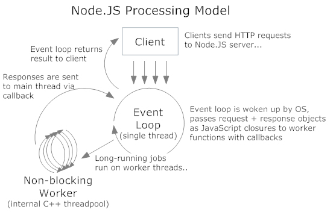

## Nodejs 는 언제 써요?
I/O 가 많이 일어날 때, CPU를 힘들게 하는 계산이 필요하면 부적합.

### Input/Output
application은 디스크에서 읽어지는게 아니라 메모리(램)에서 구동된다. 그러면서 CPU사용량이 올라간다. 이건 캐싱 매커니즘(Memcached) 덕분에 속도가 빠른 편이다.
하지만 os에서 파일을 읽어오거나 네트워크 통신 같은 I/O의 경우 처리속도가 **느리다**.

### Single-thread
Nodejs는 Single-thread 기반으로 돌아간다. 즉, 한 번에 한 가지 요청을 수행할 수 있다.
그래서 CPU 부하가 큰 요청을 받아버리면 latency가 길어지므로 다음 요청을 수행하기 버거워진다.
더군다나 Nodejs 는 non-blocking I/O 모델인데, 한번 CPU를 잡아먹는 요청을 해버리면 다음 요청도 계속 들어오고 CPU부하는 더 커진다.

### not thread-base, but Event-driven architecture.
하지만 Nodejs 는 event-driven architecture 다.
Single-thread가 event loop를 돌면서 요청을 받는다. 그리고 그 요청을 내부의 libuv(threads)가 비동기(asyncronous)로 처리한다. 완료된 일(callback)을 다시 event loop(아까 요청 받은 그 single thread라는 놈)로 보내서 결과를 리턴시켜주면 일이 끝난다.

### 결론
그러니까 thread 혼자서(single-thread) 일이 끝날때까지 막지 않아도 된다.(non-blocking)
single-thread는 일의 시작과 끝만 책임지고 있는 거라고 봐도 될까.
결국 Nodejs는 Input/Ouput 을 기다리지 않아도 된다. 빠르다. 데드락이 없다.

## 참고한 글.
- [Understanding the node.js event loop](http://blog.mixu.net/2011/02/01/understanding-the-node-js-event-loop/)
- [Understanding Node.js](https://www.codeschool.com/blog/2014/10/30/understanding-node-js/)
